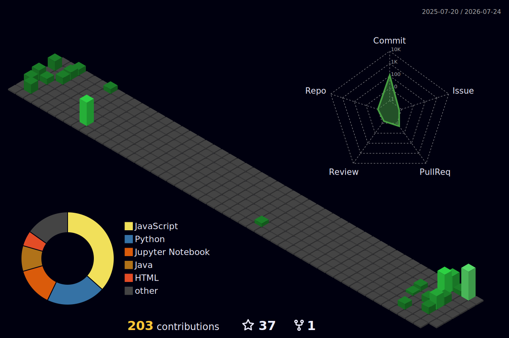

<div align="center">
  <a href="https://git.io/typing-svg">
    
  </a>
</div>

<br>

<p align="left">
  
</p>

---


```yaml
Name        : Garvita Kesarwani
Degree      : B.Tech – Computer Science & Engineering
Focus       : Software Development · DevSecOps · AI/ML · Full-Stack MERN
Currently   : Learning DevSecOps & AI Agents
Ask me about: Java · DSA · Full-Stack MERN · AI/ML/DL · DevSecOps
Reach me at : garvitakesharwani22@gmail.com
```

<br clear="right"/>

---

## 🤝 Connect with Me

<p align="left">
  <a href="https://linkedin.com/in/garvitakesarwani2003" target="blank">
    
  </a>
  <a href="https://www.hackerrank.com/mishtikesarwani1" target="blank">
    
  </a>
  <a href="https://www.leetcode.com/garvita2003" target="blank">
    
  </a>
</p>

---

## 🧰 Languages & Tools

<!-- Row 1: Cloud & DevOps -->
<p align="left">
  <a href="https://azure.microsoft.com/en-in/" target="_blank"></a>
  <a href="https://cloud.google.com" target="_blank"></a>
  <a href="https://www.docker.com/" target="_blank"></a>
  <a href="https://kubernetes.io" target="_blank"></a>
  <a href="https://grafana.com" target="_blank"></a>
  <a href="https://www.gnu.org/software/bash/" target="_blank"></a>
  <a href="https://www.linux.org/" target="_blank"></a>
  <a href="https://git-scm.com/" target="_blank"></a>
</p>

<!-- Row 2: Frontend -->
<p align="left">
  <a href="https://www.w3.org/html/" target="_blank"></a>
  <a href="https://www.w3schools.com/css/" target="_blank"></a>
  <a href="https://developer.mozilla.org/en-US/docs/Web/JavaScript" target="_blank"></a>
  <a href="https://reactjs.org/" target="_blank"></a>
  <a href="https://redux.js.org" target="_blank"></a>
  <a href="https://tailwindcss.com/" target="_blank"></a>
  <a href="https://getbootstrap.com" target="_blank"></a>
  <a href="https://www.figma.com/" target="_blank"></a>
</p>

<!-- Row 3: Backend & Databases -->
<p align="left">
  <a href="https://nodejs.org" target="_blank"></a>
  <a href="https://expressjs.com" target="_blank"></a>
  <a href="https://www.java.com" target="_blank"></a>
  <a href="https://www.mongodb.com/" target="_blank"></a>
  <a href="https://www.mysql.com/" target="_blank"></a>
  <a href="https://www.postgresql.org" target="_blank"></a>
  <a href="https://www.microsoft.com/en-us/sql-server" target="_blank"></a>
  <a href="https://mariadb.org/" target="_blank"></a>
  <a href="https://postman.com" target="_blank"></a>
</p>

<!-- Row 4: Python / AI / ML -->
<p align="left">
  <a href="https://www.python.org" target="_blank"></a>
  <a href="https://www.tensorflow.org" target="_blank"></a>
  <a href="https://pytorch.org/" target="_blank"></a>
  <a href="https://scikit-learn.org/" target="_blank"></a>
  <a href="https://opencv.org/" target="_blank"></a>
  <a href="https://pandas.pydata.org/" target="_blank"></a>
  <a href="https://seaborn.pydata.org/" target="_blank"></a>
  <a href="https://matplotlib.org/" target="_blank"></a>
  <a href="https://numpy.org/" target="_blank"></a>
  <a href="https://keras.io/" target="_blank"></a>
</p>

<!-- Row 5: AI Ecosystem / Notebooks / Misc -->
<p align="left">
  <a href="https://huggingface.co/" target="_blank"></a>
  <a href="https://www.langchain.com/" target="_blank"></a>
  <a href="https://ollama.com/" target="_blank"></a>
  <a href="https://streamlit.io/" target="_blank"></a>
  <a href="https://jupyter.org/" target="_blank"></a>
  <a href="https://www.blender.org/" target="_blank"></a>
</p>

---

## 📊 GitHub Stats

<div align="center">
  
</div>

<br>

<div align="center">
  
</div>

<div align="center">
  
</div>

<h2>   &nbsp;My GitHub History! 📈</h2>



---

## 🐍 Contribution Snake

<picture>
  <source media="(prefers-color-scheme: dark)" srcset="https://raw.githubusercontent.com/garvita2003/garvita2003/output/github-snake-dark.svg" />
  <source media="(prefers-color-scheme: light)" srcset="https://raw.githubusercontent.com/garvita2003/garvita2003/output/github-snake.svg" />
  
</picture>

---

## 📈 Activity Graph


---

<p align="center">
  <i>💬 Ask me about Java, DSA, Full-Stack MERN, DevSecOps, AI/ML/DL, or Agents!</i><br>
  <i>📫 Reach me at <a href="mailto:garvitakesharwani22@gmail.com">garvitakesharwani22@gmail.com</a></i>
</p>
